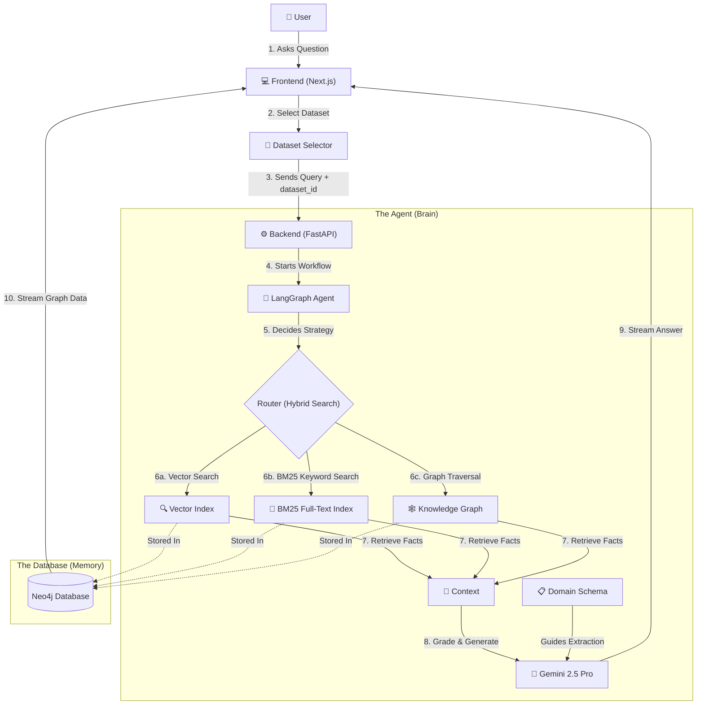

# Project Atlas: The Enterprise Brain

This document is your **Mental Map** of the project. It is designed to help you visualize *what* we built, *where* everything lives, and *how* it all connects.

## 1. The "Why" (The Core Concept)
**Problem**: Standard AI chatbots "hallucinate" (make things up) because they just guess the next word based on probability.
**Solution**: We built a "Brain" that has two parts:
1.  **Memory (Neo4j)**: A structured database of facts (Knowledge Graph) + text search (Vectors).
2.  **Reasoning (LangGraph)**: An agent that "thinks" in steps (Plan -> Search -> Check -> Answer).

**Analogy**: Instead of a student guessing answers on a test (Standard AI), this is a student who goes to the library, looks up specific books, checks if the facts match the question, and *then* writes the answer.

---

## 2. The Architecture (The Big Picture)
This diagram shows how the pieces fit together.



---

## 3. The "Life of a Query" (Step-by-Step)
Imagine a user asks: *"How is Company A connected to Company B?"*

1.  **Frontend ([ChatInterface.tsx](frontend/components/ChatInterface.tsx))**:
    *   Catches the user's text.
    *   Opens a "Stream" using Server-Sent Events (SSE) to the backend.
    *   *Visual*: Shows "Connecting to Agent..." status.

2.  **Backend ([main.py](backend/main.py))**:
    *   Receives the question.
    *   Wakes up the **Agent** and streams `astream_events` back.

3.  **The Agent's Journey ([graph.py](backend/agent/graph.py) & [nodes.py](backend/agent/nodes.py))**:
    *   **Step A: Retrieve**: The agent uses **hybrid search** — both vector similarity (Google Embeddings `text-embedding-004`) AND BM25 keyword matching via the full-text index. Results are merged using **Reciprocal Rank Fusion (RRF)**. HNSW recall is boosted with `ef_search=300` (tripled from the default 100). The retriever is cached per `dataset_id` in `_retriever_cache` for performance.
    *   **Step B: Grade**: The agent (secretly) asks Gemini via Structured Output Grader: *"Does this information actually answer the question?"*
        *   *If No*: It rewrites the search query (`transform_query`) and tries again (The Loop).
        *   *If Yes*: It proceeds.
    *   **Step C: Generate**: The agent writes the final answer using the filtered facts it retrieved.

4.  **The Response**:
    *   The **Text** appears word-by-word on the screen via SSE (`@microsoft/fetch-event-source`).
    *   The **Pipeline Visualizer** shows the agent's progress in real-time: stages **Retrieve -> Grade -> Rewrite -> Generate** each light up with spinning/completed indicators as the agent processes.
    *   The **Graph** ([GraphViz.tsx](frontend/components/GraphViz.tsx)) updates using `react-force-graph-2d`, drawing the actual nodes (Company A, Company B), the Query, and the specific relationship lines the agent traversed. **Retrieved chunks are highlighted** via `highlightNodeIds` — non-retrieved nodes are dimmed so the user can see exactly which pieces of knowledge fed the answer.

---

## 4. The File Map (Where things live)
Here is the physical layout of your project, with a plain-English explanation for every file.

### 📂 `backend/` (The Brain)
*   📄 **`main.py`**: **The Doorway**. This is the FastAPI server with THREE endpoints: `/stream`, `/graph`, and `/datasets`. All accept a `dataset_id` parameter for dataset isolation. Uses `SHOW INDEXES` (not `CALL db.indexes()`) for index discovery. Uses `COALESCE(n.id, n.name, elementId(n))` for entity names. Emits `stage:retrieve`, `stage:grade`, `stage:rewrite`, `stage:generate` status events for the pipeline visualizer.
*   📄 **`ingestion.py`**: **The Librarian**. Uses `pymupdf4llm.to_markdown()` for structure-aware PDF loading and `MarkdownHeaderTextSplitter` for section-aware chunking. Creates BOTH a vector index AND a BM25 full-text index per dataset. Has a `DOMAIN_SCHEMAS` dict with "ml" and "research" schemas to guide entity extraction. Accepts `dataset_id` and `domain` parameters. Tags every chunk with `dataset_id`. Uses `LLMGraphTransformer` to dynamically extract Entities (Graph), and manually links contiguous text chunks via Cypher (`[:NEXT_CHUNK]`).
*   📄 **`requirements.txt`**: **The Shopping List**. Lists all the Python tools we need (LangChain, FastAPI, Google GenAI SDKs, Neo4j, etc.).
*   📂 **`agent/`**: **The Thinking Logic**
    *   📄 **`graph.py`**: **The Flowchart**. Dictates the conditional edges (Start -> Retrieve -> Check -> Generate/Rewrite -> End).
    *   📄 **`nodes.py`**: **The Workers**. Contains `GRADING_MODEL = os.getenv("GEMINI_GRADING_MODEL", "gemini-2.5-flash-lite")` for grading (was gemini-2.0-flash, now deprecated). Has `_retriever_cache` dict and `get_retriever(dataset_id)` function that builds a hybrid retriever per dataset. Uses `search_kwargs={"k": 10, "ef_search": 300}`. Also contains the LLM grader and query re-writer logic driven by Gemini 2.5 Pro.
    *   📄 **`state.py`**: **The Short-term Memory**. Tracks the question, retrieved documents, generations, decision fallbacks (`web_search`), and `dataset_id: str` field for dataset routing.

### 📂 `backend/` (Utility Scripts)
*   📄 **`ingest_all.py`**: **The Master Ingestor**. Contains a `MANIFEST` dict mapping 19 PDFs to 4 datasets. CLI usage: `--list` (show datasets), `--dataset <name>` (ingest one), or no args to ingest all.
*   📄 **`extract_entities.py`**: **Entity Extraction Only**. Reads existing Chunk nodes from Neo4j and runs `LLMGraphTransformer` without re-embedding. Useful for re-extracting entities after schema changes.

### 📂 `frontend/` (The Face)
*   📄 **`app/page.tsx`**: **The Main Page**. Layout for the Next.js App Router.
*   📄 **`components/ChatInterface.tsx`**: **The Conversation**. Has dataset selector buttons (color-coded per dataset) and a pipeline stage visualizer (Retrieve -> Grade -> Rewrite -> Generate with spinning/completed indicators). Manages `highlightNodeIds` state passed to GraphViz for chunk highlighting. Sends queries via Streaming API with `dataset_id` and decodes the Graph Payload alongside text tokens in real time.
*   📄 **`components/GraphViz.tsx`**: **The Visualizer**. A Force-Directed JSON graph instance with glow effects (`ctx.shadowBlur`), animated edge particles (`linkDirectionalParticles=3`), degree-based node sizing, and a click-to-inspect detail panel. Expanded color palette for research entity types (Author, Institution, Method, Paper, etc.). Accepts `highlightNodeIds` prop to dim non-retrieved nodes and highlight the chunks that fed the answer.

### 📂 `Root Directory`
*   📄 **`docker-compose.yml`**: **The Infrastructure**. Pre-configures a standalone container of Neo4j with APOC plugins running purely in Docker.
*   📄 **`frontend/Dockerfile`**: A multi-stage image blueprint for hosting your Next.js Chat interface.

---

## 5. Common Questions
### "Does Gemini talk directly to Neo4j?"
**No, and that's a good thing.**
1.  **The Agent (LangGraph/Python)** runs a search query against Neo4j Vector Stores.
2.  **Neo4j** returns the relevant facts (e.g., "Company A bought Company B").
3.  **The Agent** embeds these facts into a strict Prompt Template:
    > "Answer the question based only on the following context: [Company A bought Company B]..."
4.  **Gemini** reads the prompt and writes the answer.

**Why?** This grounds the LLM to context and prevents hallucinations entirely. It can only use the data provided to its prompt.

### "What if the database is empty or doesn't have the answer?"
1.  **Search**: The Agent looks in Neo4j and finds nothing.
2.  **Grade**: The Grader evaluates relevance and gives a "No".
3.  **Self-Correction**: The Agent sees `web_search == "Yes"`. It thinks: *"Maybe I searched for the wrong thing?"*
4.  **Rewrite**: Node `transform_query` asks the LLM to re-evaluate the semantic intent, changing keywords, and searches again.
5.  **Give Up (Honest)**: Eventually, without valid documents to map, the flow terminates transparently rather than making up facts.

### "Why not just use ChatGPT or vanilla Gemini?"
**The Use Case**: Imagine you are a **Bank** or a **Hospital**.
1.  **Privacy**: You cannot broadcast private financial data to public commercial endpoints willy-nilly.
2.  **Specificity**: Base models know nothing about recent, confidential M&A documents, internal Slack records, or zero-day financial filings unless fine-tuned or anchored with live context (RAG).
3.  **Liability & Auditing**: You need proof. A deterministic Graph shows *exactly* what nodes fed the answer. A standard AI model can't do that.

### "How do different datasets stay isolated?"
Each dataset gets its own named Neo4j vector index (`vector_index_{dataset_id}`) and full-text index (`vector_index_{dataset_id}_ft`). At query time, the retriever only searches that specific dataset's index. The `/graph` endpoint filters entities by traversing from Chunk nodes tagged with `dataset_id`. This is physical isolation at the index level — impossible for data to cross datasets.

### "What is hybrid search and why use it?"
Combines vector search (semantic similarity via embeddings) with BM25 keyword search (exact term matching via full-text index). Results are merged using Reciprocal Rank Fusion. Vector search catches paraphrases ("memory management" matches "KV cache optimization"), BM25 catches exact terms ("PagedAttention" matches "PagedAttention" even if the embedding distance is large). Together they dramatically improve recall for technical content.

### "What is a 'Multi-hop' query?"
This is the superpower of this system.
*   **Vector Search (Standard AI)** is essentially fuzzy keyword search.
    *   *Query*: "Apple iPhone battery" -> *Result*: Docs about Apple, iPhone, and batteries.
*   **Multi-hop Graph Reasoning**: Following interconnected knowledge facts.
    *   *Query*: **"Who is the CEO of the company that bought GitHub?"**
        1.  **Hop 1**: Find "GitHub".
        2.  **Hop 2**: Traverse `[:ACQUIRED_BY]` link -> "Microsoft".
        3.  **Hop 3**: Traverse `[:CEO]` link -> "Satya Nadella".

**The Hybrid Edge**: Our system uses Neo4jVector for "Hop 1" lookup semantics, and `LLMGraphTransformer` extracted paths to traverse complex business logic.

---

## 6. Naive RAG vs. Enterprise Brain
This is the perfect slide for your presentation.

| Feature | Naive RAG (Standard) | Enterprise Brain (Your Project) |
| :--- | :--- | :--- |
| **Architecture** | **Linear** (Retrieve -> Generate) | **Cyclic** (Plan -> Retrieve -> Grade -> Loop) |
| **Retrieval** | **Vector Only** (Keywords/Similarity) | **Hybrid Triple** (Vector + BM25 + Graph Structure) |
| **Dataset Isolation** | ❌ Single index | ✅ Per-dataset isolated indexes |
| **Multi-Hop Reasoning** | ❌ **Fails**. Can't connect A->B->C seamlessly if split across docs. | ✅ **Excels**. Follows the visual graph edges A->B->C. |
| **Hallucination** | **High**. Guesses when unsure. | **Low**. Reflexion forces it to say "I don't know." |
| **Explainability** | **Black Box**. "Here is the answer." | **Visual Transparency**. Shown animated via React Force-Graph. |

---

## 7. Resume Snippet (Copy-Paste this)
Here is the updated version aligned specifically to your code: Gemini, LLMGraphTransformer, LangGraph, and Next.js SSE.

```latex
\cventry
  {Independent Developer} % Role
  {Autonomous Graph-Grounded Agentic RAG System ("Enterprise Brain")} % Project Name
  {} % Location
  {Jan. 2026 - Present} % Dates
  {
    \begin{cvitems}
      \item {Architected a \textbf{Neuro-Symbolic AI} framework minimizing financial hallucinations by anchoring \textbf{Gemini 2.5 Pro} reasoning to a deterministic \textbf{Neo4j Knowledge Graph}, extracted natively via Langchain's \textbf{LLMGraphTransformer}.}
      \item {Engineered a self-correcting 'Control Flow' loop using \textbf{LangGraph} that implements \textbf{Hybrid Retrieval}—combining Google \textbf{text-embedding-004} vector similarity with graph traversal to dynamically grade, reject, or rewrite queries.}
      \item {Developed a highly-responsive \textbf{FastAPI} streaming backend utilizing \textbf{Server-Sent Events (SSE)} to parse 'Thought Process' telemetry to a \textbf{Next.js} dashboard with real-time Network Visualization using \textbf{react-force-graph-2d}.}
    \end{cvitems}
  }
```

---

## 8. Real Data Strategy (Kaggle / SEC)
You want **Real Data** to make this impressive. The ingestion script (`backend/ingestion.py`) handles raw text easily:

### The "Wall Street" Approach
Download **SEC 10-K Filings** (Annual Reports) for big companies.
1.  Go to SEC.gov and download the PDF for Apple or Microsoft.
2.  Put it in `backend/data/`.
3.  Run `python ingestion.py`.
*Why?* If your AI can answer questions and visually traverse a 100-page Apple report, it proves Enterprise viability.

## 9. The Tech Stack (Complete List)

### 🧠 AI & Logic
*   **LangGraph**: Core state machine and cyclic router.
*   **LangChain**: Tooling interconnects and graph transformations (`LLMGraphTransformer`).
*   **Google Gemini 2.5 Pro**: The primary intelligence model.
*   **Google Gemini 2.5 Flash Lite**: The grading model (lightweight, fast evaluation).
*   **Google Text-Embedding-004**: The vector spatial embedder.
*   **pymupdf4llm**: Structure-aware PDF-to-Markdown conversion.

### ⚙️ Backend (Python)
*   **FastAPI**: API endpoints (`/graph`, `/stream`, `/datasets`).
*   **SSE (Server-Sent Events)**: Utilizing `sse_starlette` for multi-stage payload streaming.
*   **Neo4j Python Driver**: Underlying direct Cypher query executions.
*   **`ingest_all.py`**: Master ingestion script (19 PDFs across 4 datasets).
*   **`extract_entities.py`**: Standalone entity extraction script (no re-embedding).

### 💾 Database
*   **Neo4j Graph Database**: Native knowledge and Vector Store persistence (Docker).
*   **BM25 Full-text indexes**: Paired with each vector index for hybrid keyword search.

### 💻 Frontend (TypeScript)
*   **Next.js (App Router)**: Orchestration and rendering engine.
*   **Tailwind CSS**: Rapid utility styling.
*   **React Force-Graph**: 2D force-directed canvas.
*   **Microsoft Fetch Event Source**: Reliable streaming connection logic.

## 10. What do I do next?
1.  **Feed the Brain**: Run `docker exec -it graphrag-backend python ingest_all.py --dataset book` to ingest the ML book. Then run papers: `--dataset papers_energy_sustainability`, etc.
2.  **Spin Up**: Run `docker-compose up -d` — frontend at :3005, backend at :8005.
3.  **Switch datasets in the UI** — the dataset selector routes queries to isolated indexes. Watch the pipeline visualizer light up as the agent processes your question.
